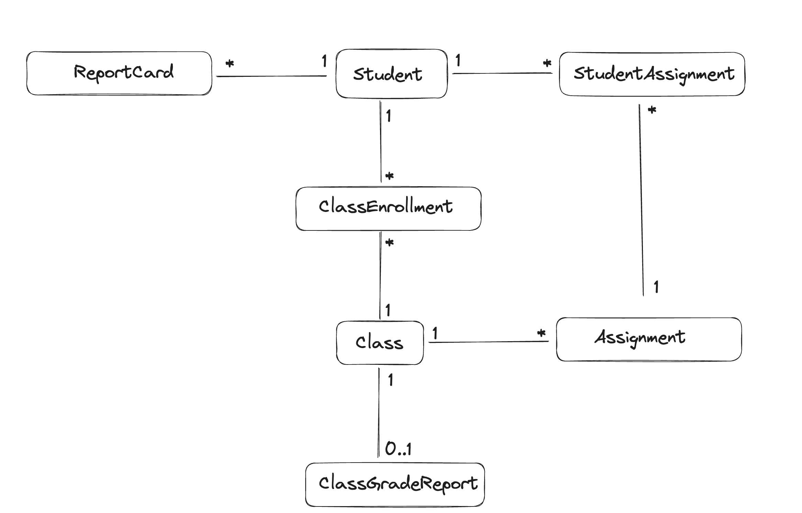

This is where you'll write your best-practice-first implementation of the refactoring to 4 tiers exercise to the High School Domain.

## Getting Started

1. Install the dependencies
   1. `npm install`
2. Run the application
   1. `npm start:dev`
3. You can access the application at `http://localhost:3000`
4. You can interact with the API through any API client like Postman, Insomnia or your CLI.

## Database Schema

The database schema is as follows:

